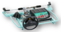
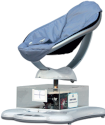

 

-   :octicons-graph-16:{ .lg .middle } __BGR-300__
 
    --- 
 
    Boule gyrostabilisée 2 étages [DIDASTEL](http://www.didastel.fr/)
    { align=left } 
 
    [:octicons-arrow-right-24: BGR-300](bgr-300) 

-   :octicons-graph-16:{ .lg .middle } __Bras BETA__
 
    --- 
 
    Le Bras BETA reproduit un système de cotrôle de tubes de géérateur de vapeur. [S2IDIDAC](https://s2ididac.com/)
    { align=left } 
 
    [:octicons-arrow-right-24: Bras BETA](bras-beta) 

-   :octicons-graph-16:{ .lg .middle } __Cheville NAO__
 
    --- 
 
    Cheville didactisée du robot NAO [ERM]()
    { align=left } 
 
    [:octicons-arrow-right-24: Cheville NAO](cheville-nao) 

-   :octicons-graph-16:{ .lg .middle } __CoMAX__
 
    --- 
 
    Le robot collaboratif CoMAX est un système permettant d'assister le maniemnent des charges lourdes. [DIDASTEL]()
    { align=left } 
 
    [:octicons-arrow-right-24: CoMAX](comax) 

-   :octicons-graph-16:{ .lg .middle } __ControlX__
 
    --- 
 
    Le controle X est un axe industriel asservi. [DMS]()
    { align=left } 
 
    [:octicons-arrow-right-24: ControlX](controlx) 

-   :octicons-graph-16:{ .lg .middle } __Cordeuse__
 
    --- 
 
    Cordeuse de raquette didactisée. [DMS]()
    { align=left } 
 
    [:octicons-arrow-right-24: Cordeuse](cordeuse) 

-   :octicons-graph-16:{ .lg .middle } __Direction Assistée Electrique__
 
    --- 
 
    La DAE est un système instrumentée issue d'une TWINGO [DMS]()
    { align=left } 
 
    [:octicons-arrow-right-24: Direction Assistée Electrique](dae) 

-   :octicons-graph-16:{ .lg .middle } __D2C__
 
    --- 
 
    Le Drone Didactique Commandé permet d'anlyser le tangage d'un drone [DMS]()
    { align=left } 
 
    [:octicons-arrow-right-24: D2C](d2c) 

-   :octicons-graph-16:{ .lg .middle } __Ericc 3__
 
    --- 
 
    Le robot Ericc 3 est un robot industriel 6 axes. 
    { align=left } 
 
    [:octicons-arrow-right-24: Ericc 3](ericc) 

-   :octicons-graph-16:{ .lg .middle } __Evolap__
 
    --- 
 
    L'evolap s'inspire du fonctionnement d'un robot endoscopique. [DMS]()
    { align=left } 
 
    [:octicons-arrow-right-24: Evolap](evolap) 

-   :octicons-graph-16:{ .lg .middle } __MaxPID__
 
    --- 
 
    Les MaxPID et MaxPID-E sont la partie opérative de robots. [DIDASTEL](DIDASTEL)
    { align=left } 
 
    [:octicons-arrow-right-24: MaxPID](maxpid) 

-   :octicons-graph-16:{ .lg .middle } __Moteur à courant continu__
 
    --- 
 
    Platine équipée d'un moteur à courant continu permettant d'analyser son fonctionnement. [3sigma]()
    { align=left } 
 
    [:octicons-arrow-right-24: Moteur à courant continu](moteurcc) 

-   :octicons-graph-16:{ .lg .middle } __Moby Crea__
 
    --- 
 
    Système permettant d'aider au bercement des bébés. [CREA]()
    { align=left } 
 
    [:octicons-arrow-right-24: Moby Crea](moby-crea) 

-   :octicons-graph-16:{ .lg .middle } __Pilote Automatique de Voilier__
 
    --- 
 
    Bloc hydraulique permettant d'asservir la position du safran d'un voilier. [CREA]()
    { align=left } 
 
    [:octicons-arrow-right-24: Pilote Automatique de Voilier](pilote-auto) 

-   :octicons-graph-16:{ .lg .middle } __Portail ABB__
 
    --- 
 
    Fermeture automatique d'un portail. 
    { align=left } 
 
    [:octicons-arrow-right-24: Portail ABB](portail) 

-   :octicons-graph-16:{ .lg .middle } __Robot à câbles RC4__
 
    --- 
 
    Robot à câbles plan [DIDASTEL]()
    { align=left } 
 
    [:octicons-arrow-right-24: Robot à câbles RC4](rc4) 

-   :octicons-graph-16:{ .lg .middle } __Robot Delta 2D__
 
    --- 
 
    Robot delta2D plan [3sigma]()
    { align=left } 
 
    [:octicons-arrow-right-24: Robot Delta 2D](robot-delta) 

-   :octicons-graph-16:{ .lg .middle } __Robot Haptique__
 
    --- 
 
    Robot à retour de forces. 
    { align=left } 
 
    [:octicons-arrow-right-24: Robot Haptique](robot-haptique) 

-   :octicons-graph-16:{ .lg .middle } __Barrière Symapct__
 
    --- 
 
    Barrière automatisée. [DIDASTEL]()
    { align=left } 
 
    [:octicons-arrow-right-24: Barrière Symapct](sympact) 

-   :octicons-graph-16:{ .lg .middle } __Toit de 206 cc__
 
    --- 
 
    Toit automatisé de 206 CC piloté par un groupe hydraulique. [DMS]()
    { align=left } 
 
    [:octicons-arrow-right-24: Toit de 206 cc](toit-206) 

-   :octicons-graph-16:{ .lg .middle } __Tourelle 2 axes__
 
    --- 
 
    Tourelle 2 axes pour faire des vidéos avec des téléphones portables. [S2IDidac]()
    { align=left } 
 
    [:octicons-arrow-right-24: Tourelle 2 axes](tourelle) 

-   :octicons-graph-16:{ .lg .middle } __Imprimante 3D__
 
    --- 
 
    Imprimante 3D didactisée [DIDASTEL]()
    { align=left } 
 
    [:octicons-arrow-right-24: Imprimante 3D](i3d) 

-   :octicons-graph-16:{ .lg .middle } __Plateforme 6 axes__
 
    --- 
 
    Plateforme Stewart 6 axes, vérins électriques 
    { align=left } 
 
    [:octicons-arrow-right-24: Plateforme 6 axes](plateforme) 

-   :octicons-graph-16:{ .lg .middle } ____
 
    --- 
 
     
    { align=left } 
 
    [:octicons-arrow-right-24: ]() 

-   :octicons-graph-16:{ .lg .middle } __Arduino__
 
    --- 
 
    Pilotage de cartes Arduino [Arduino](https://www.arduino.cc/)
    { align=left } 
 
    [:octicons-arrow-right-24: Arduino](arduino) 

-   :octicons-graph-16:{ .lg .middle } __Solidworks__
 
    --- 
 
    Modélisation géométrique et cinématique avec SolidWors et Méca 3D. [Dassault Systèmes](https://www.3ds.com/fr/)
    { align=left } 
 
    [:octicons-arrow-right-24: Solidworks](sw) 

-   :octicons-graph-16:{ .lg .middle } __Matlab Simulink__
 
    --- 
 
    Modélisation des systèmes avec Matlab et Simulink. [Mathworks]()
    { align=left } 
 
    [:octicons-arrow-right-24: Matlab Simulink](matlab) 

