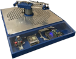
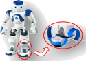
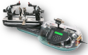
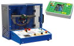
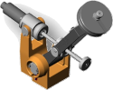

TO DO

-   :octicons-graph-16:{ .lg .middle } __BGR-300__

    ---

    Boule gyrostabilisée [DIDASTEL](http://www.didastel.fr/}.
	{ align=left }

    [:octicons-arrow-right-24: BGR-300](bgr-300)
	
-   :octicons-graph-16:{ .lg .middle } __Bras Beta__

    ---

    Bras Beta [S2IDIDAC](https://s2ididac.com/)
	
	{ align=left }
	
    [:octicons-arrow-right-24: Bras Beta](bras-beta)

-   :octicons-graph-16:{ .lg .middle } __Cheville NAO__

    ---

    Cheville du robot NAO - ERM
	
	{ align=left }
	
    [:octicons-arrow-right-24: Cheville NAO](cheville-nao)

-   :octicons-graph-16:{ .lg .middle } __CoMAX__

    ---

    Robot CoMAX, assistance au maniement de charges lourdes [Didastel](http://www.didastel.fr/}
	
	{ align=left }
	
    [:octicons-arrow-right-24: CoMAX](comax)

-   :octicons-graph-16:{ .lg .middle } __ControlX__

    ---

    Commande d'axe industriel linéaire
	
	{ align=left }
	
    [:octicons-arrow-right-24: ControlX](control-x)

-   :octicons-graph-16:{ .lg .middle } __Cordeuse de raquette__

    ---

    Cordeuse de raquette
	
	{ align=left }
	
    [:octicons-arrow-right-24: Cordeuse](cordeuse)

-   :octicons-graph-16:{ .lg .middle } __Direction Assistée Electrique__

    ---

    Direction assistée électriqued de Twingo
	
	{ align=left }
	
    [:octicons-arrow-right-24: DAE](dae)

-   :octicons-graph-16:{ .lg .middle } __Drone Didactique Controlé__

    ---

	Drone didactique controlé. Asservissement de l'axe de tangage
	
	{ align=left }
	
    [:octicons-arrow-right-24: D2C](d2c)

-   :octicons-graph-16:{ .lg .middle } __Robot Ericc__

    ---

    Robot industriel 6 axes
	
	{ align=left }
	
    [:octicons-arrow-right-24: Ericc](ericc)

-   :octicons-graph-16:{ .lg .middle } __Maxpid__

    ---

    Robots MaxPID et MaxPID-E
	
	{ align=left }
	
    [:octicons-arrow-right-24: MaxPID](maxpid)	
	
-   :octicons-graph-16:{ .lg .middle } __Moby Crea__

    ---

    Moby Crea.
	
    [:octicons-arrow-right-24: Moby Crea](moby-crea)

-   :octicons-graph-16:{ .lg .middle } _Pilote Automatique de Voilier__

    ---

    Pilote
	
    [:octicons-arrow-right-24: Ericc](pilote)
	
-   :octicons-graph-16:{ .lg .middle } __Portail__

    ---

    Portail.
	
    [:octicons-arrow-right-24: Ericc](portail)

-   :octicons-graph-16:{ .lg .middle } __Robot à câbles RC4__

    ---

    RC4
	
    [:octicons-arrow-right-24: RC4](rc4)

-   :octicons-graph-16:{ .lg .middle } __Robot Delta 2D__

    ---

    Robot Delta3D
	
    [:octicons-arrow-right-24: Ericc](robot-delta)

-   :octicons-graph-16:{ .lg .middle } __Robot Haptique__

    ---

    Robot haptique.
	
    [:octicons-arrow-right-24: Ericc](robot-haptique)

-   :octicons-graph-16:{ .lg .middle } __Barrière Sympact__

    ---

    Barrière Sympact.
	
    [:octicons-arrow-right-24: Barrière Sympact](sympact)

-   :octicons-graph-16:{ .lg .middle } __Imprimante 3D I3D__

    ---

    Imprimante 3D
	
    [:octicons-arrow-right-24: I3D](i3d)

-   :octicons-graph-16:{ .lg .middle } __Plateforme 6 axes__

    ---

    Plateforme
	
    [:octicons-arrow-right-24: Plateforme](plateforme)

