# Capteur pneumatique 

 

-   :octicons-graph-16:{ .lg .middle } __Capteur pneumatique__
 
    --- 
 
    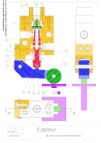{ align=left } 
    [:octicons-arrow-right-24: Plan](https://github.com/xpessoles/03_Etude_Cinematique_Systemes_Solides_Chaine_Energie_Analyser_Modeliser_Resoudre/tree/master/Mecanismes) 
	
	[:octicons-arrow-right-24: Coloriage](https://github.com/xpessoles/03_Etude_Cinematique_Systemes_Solides_Chaine_Energie_Analyser_Modeliser_Resoudre/tree/master/Mecanismes) 
	
	[:octicons-arrow-right-24: SW](https://github.com/xpessoles/03_Etude_Cinematique_Systemes_Solides_Chaine_Energie_Analyser_Modeliser_Resoudre/tree/master/Mecanismes)

-   :octicons-graph-16:{ .lg .middle } __Pince Schrader__
 
    --- 
 
	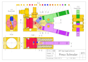{ align=left } 
    [:octicons-arrow-right-24: Plan](https://github.com/xpessoles/03_Etude_Cinematique_Systemes_Solides_Chaine_Energie_Analyser_Modeliser_Resoudre/tree/master/Mecanismes) 
	
	[:octicons-arrow-right-24: Coloriage](https://github.com/xpessoles/03_Etude_Cinematique_Systemes_Solides_Chaine_Energie_Analyser_Modeliser_Resoudre/tree/master/Mecanismes) 
	
	[:octicons-arrow-right-24: Schémas](https://github.com/xpessoles/03_Etude_Cinematique_Systemes_Solides_Chaine_Energie_Analyser_Modeliser_Resoudre/tree/master/Mecanismes)
	
	[:octicons-arrow-right-24: SW](https://github.com/xpessoles/03_Etude_Cinematique_Systemes_Solides_Chaine_Energie_Analyser_Modeliser_Resoudre/tree/master/Mecanismes)

-   :octicons-graph-16:{ .lg .middle } __Micro compresseur__
 
    --- 
 
	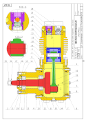{ align=left } 
    [:octicons-arrow-right-24: Plan](https://github.com/xpessoles/03_Etude_Cinematique_Systemes_Solides_Chaine_Energie_Analyser_Modeliser_Resoudre/tree/master/Mecanismes)
	
	[:octicons-arrow-right-24: Coloriage](https://github.com/xpessoles/03_Etude_Cinematique_Systemes_Solides_Chaine_Energie_Analyser_Modeliser_Resoudre/tree/master/Mecanismes) 
	
	[:octicons-arrow-right-24: Schémas](https://github.com/xpessoles/03_Etude_Cinematique_Systemes_Solides_Chaine_Energie_Analyser_Modeliser_Resoudre/tree/master/Mecanismes)

-   :octicons-graph-16:{ .lg .middle } __Pompe Manuelle__
 
    --- 
 
	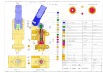{ align=left } 
    [:octicons-arrow-right-24: Plan](https://github.com/xpessoles/03_Etude_Cinematique_Systemes_Solides_Chaine_Energie_Analyser_Modeliser_Resoudre/tree/master/Mecanismes) 
	
	[:octicons-arrow-right-24: Coloriage](https://github.com/xpessoles/03_Etude_Cinematique_Systemes_Solides_Chaine_Energie_Analyser_Modeliser_Resoudre/tree/master/Mecanismes) 
	
	[:octicons-arrow-right-24: Schémas](https://github.com/xpessoles/03_Etude_Cinematique_Systemes_Solides_Chaine_Energie_Analyser_Modeliser_Resoudre/tree/master/Mecanismes)

-   :octicons-graph-16:{ .lg .middle } __Winch 2 vitesses__
 
    --- 
 
	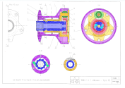{ align=left } 
    [:octicons-arrow-right-24: Plan](https://github.com/xpessoles/03_Etude_Cinematique_Systemes_Solides_Chaine_Energie_Analyser_Modeliser_Resoudre/tree/master/Mecanismes) 
	
-   :octicons-graph-16:{ .lg .middle } __Pompe PHP 15__
 
    --- 
 
	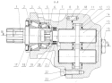{ align=left } 
    [:octicons-arrow-right-24: Plan](https://github.com/xpessoles/03_Etude_Cinematique_Systemes_Solides_Chaine_Energie_Analyser_Modeliser_Resoudre/tree/master/Mecanismes) 
	
-   :octicons-graph-16:{ .lg .middle } __Étau orientable__
 
    --- 
 
	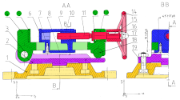{ align=left } 
    [:octicons-arrow-right-24: Plan](https://github.com/xpessoles/03_Etude_Cinematique_Systemes_Solides_Chaine_Energie_Analyser_Modeliser_Resoudre/tree/master/Mecanismes) 
	
-   :octicons-graph-16:{ .lg .middle } __Bride__
 
    --- 
 
	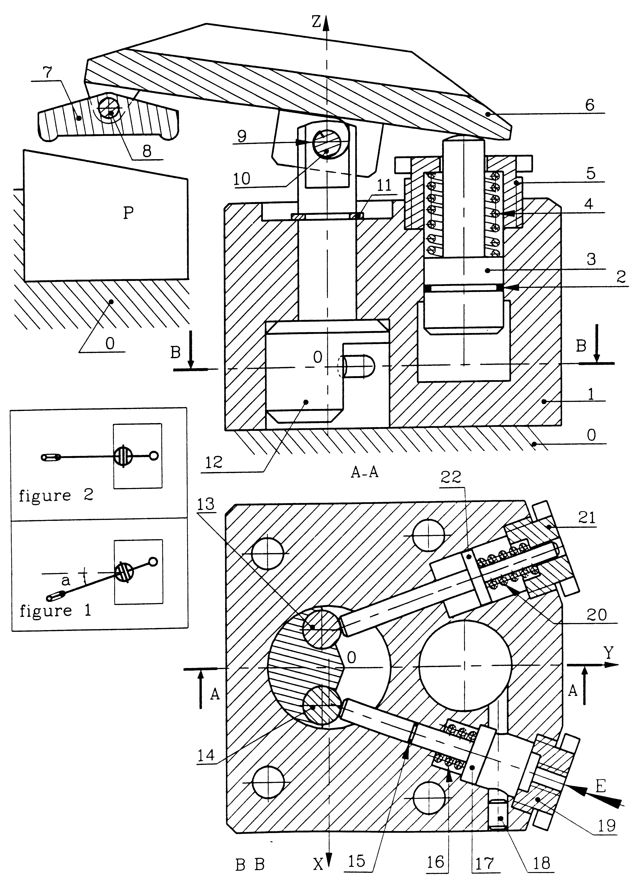{ align=left } 
    [:octicons-arrow-right-24: Plan](https://github.com/xpessoles/03_Etude_Cinematique_Systemes_Solides_Chaine_Energie_Analyser_Modeliser_Resoudre/tree/master/Mecanismes) 
	
-   :octicons-graph-16:{ .lg .middle } __Poussoir__
 
    --- 
 
	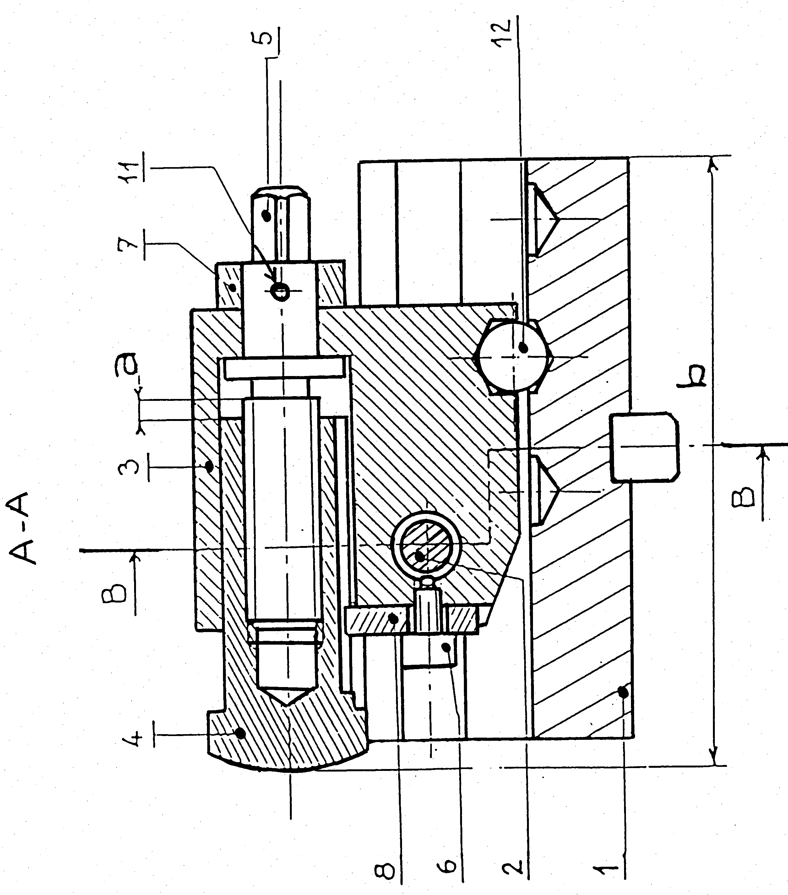{ align=left } 
    [:octicons-arrow-right-24: Plan](https://github.com/xpessoles/03_Etude_Cinematique_Systemes_Solides_Chaine_Energie_Analyser_Modeliser_Resoudre/tree/master/Mecanismes) 
	
-   :octicons-graph-16:{ .lg .middle } __Démarreur réacteur__
 
    --- 
 
	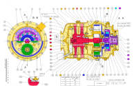{ align=left } 
    [:octicons-arrow-right-24: Plan](https://github.com/xpessoles/03_Etude_Cinematique_Systemes_Solides_Chaine_Energie_Analyser_Modeliser_Resoudre/tree/master/Mecanismes) 
	
-   :octicons-graph-16:{ .lg .middle } __Coupe tube__
 
    --- 
 
	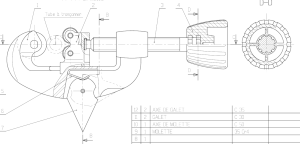{ align=left } 
    [:octicons-arrow-right-24: Plan](https://github.com/xpessoles/03_Etude_Cinematique_Systemes_Solides_Chaine_Energie_Analyser_Modeliser_Resoudre/tree/master/Mecanismes) 
	
-   :octicons-graph-16:{ .lg .middle } __Compresseur de climatiseur__
 
    --- 
 
	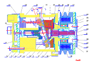{ align=left } 
    [:octicons-arrow-right-24: Plan](https://github.com/xpessoles/03_Etude_Cinematique_Systemes_Solides_Chaine_Energie_Analyser_Modeliser_Resoudre/tree/master/Mecanismes) 
	
-   :octicons-graph-16:{ .lg .middle } __Dispositif de freinage de train__
 
    --- 
 
	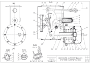{ align=left } 
    [:octicons-arrow-right-24: Plan](https://github.com/xpessoles/03_Etude_Cinematique_Systemes_Solides_Chaine_Energie_Analyser_Modeliser_Resoudre/tree/master/Mecanismes) 
	
-   :octicons-graph-16:{ .lg .middle } __Moteur de modélisme__
 
    --- 
 
	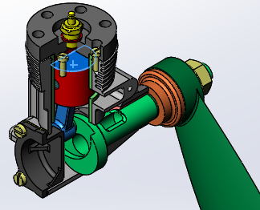{ align=left } 
    [:octicons-arrow-right-24: Plan](https://github.com/xpessoles/03_Etude_Cinematique_Systemes_Solides_Chaine_Energie_Analyser_Modeliser_Resoudre/tree/master/Mecanismes) 
	
-   :octicons-graph-16:{ .lg .middle } __Pompe volumétrique__
 
    --- 
 
	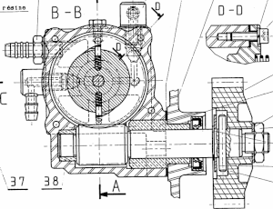{ align=left } 
    [:octicons-arrow-right-24: Plan](https://github.com/xpessoles/03_Etude_Cinematique_Systemes_Solides_Chaine_Energie_Analyser_Modeliser_Resoudre/tree/master/Mecanismes) 
	
-   :octicons-graph-16:{ .lg .middle } __Pompe hydraulique__
 
    --- 
 
	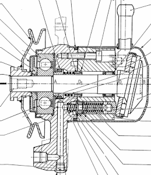{ align=left } 
    [:octicons-arrow-right-24: Plan](https://github.com/xpessoles/03_Etude_Cinematique_Systemes_Solides_Chaine_Energie_Analyser_Modeliser_Resoudre/tree/master/Mecanismes) 
	
-   :octicons-graph-16:{ .lg .middle } __Changeur d'outil__
 
    --- 
 
	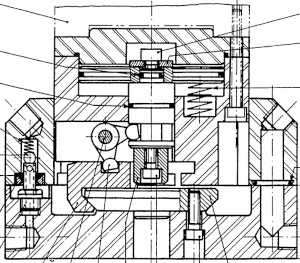{ align=left } 
    [:octicons-arrow-right-24: Plan](https://github.com/xpessoles/03_Etude_Cinematique_Systemes_Solides_Chaine_Energie_Analyser_Modeliser_Resoudre/tree/master/Mecanismes) 
	
-   :octicons-graph-16:{ .lg .middle } __Désileuse__
 
    --- 
 
	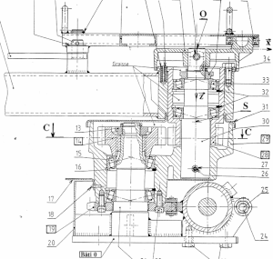{ align=left } 
    [:octicons-arrow-right-24: Plan](https://github.com/xpessoles/03_Etude_Cinematique_Systemes_Solides_Chaine_Energie_Analyser_Modeliser_Resoudre/tree/master/Mecanismes) 
	
	
-   :octicons-graph-16:{ .lg .middle } __Pompe à pistons__
 
    --- 
 
	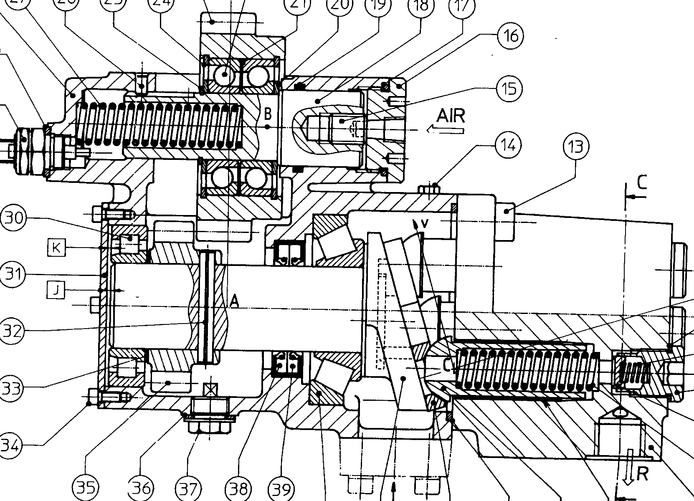{ align=left } 
    [:octicons-arrow-right-24: Plan](https://github.com/xpessoles/03_Etude_Cinematique_Systemes_Solides_Chaine_Energie_Analyser_Modeliser_Resoudre/tree/master/Mecanismes) 
	
-   :octicons-graph-16:{ .lg .middle } __Roue motrice et directrice__
 
    --- 
 
	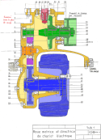{ align=left } 
    [:octicons-arrow-right-24: Plan](https://github.com/xpessoles/03_Etude_Cinematique_Systemes_Solides_Chaine_Energie_Analyser_Modeliser_Resoudre/tree/master/Mecanismes) 
	
-   :octicons-graph-16:{ .lg .middle } __Touret à meuler__
 
    --- 
 
	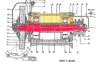{ align=left } 
    [:octicons-arrow-right-24: Plan](https://github.com/xpessoles/03_Etude_Cinematique_Systemes_Solides_Chaine_Energie_Analyser_Modeliser_Resoudre/tree/master/Mecanismes) 
	
-   :octicons-graph-16:{ .lg .middle } __Perforateur__
 
    --- 
 
	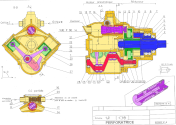{ align=left } 
    [:octicons-arrow-right-24: Plan](https://github.com/xpessoles/03_Etude_Cinematique_Systemes_Solides_Chaine_Energie_Analyser_Modeliser_Resoudre/tree/master/Mecanismes) 
	
-   :octicons-graph-16:{ .lg .middle } __Boite de transfert__
 
    --- 
 
	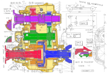{ align=left } 
    [:octicons-arrow-right-24: Plan](https://github.com/xpessoles/03_Etude_Cinematique_Systemes_Solides_Chaine_Energie_Analyser_Modeliser_Resoudre/tree/master/Mecanismes) 
	
-   :octicons-graph-16:{ .lg .middle } __Rouleau d'entrainement__
 
    --- 
 
	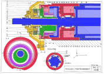{ align=left } 
    [:octicons-arrow-right-24: Plan](https://github.com/xpessoles/03_Etude_Cinematique_Systemes_Solides_Chaine_Energie_Analyser_Modeliser_Resoudre/tree/master/Mecanismes) 
	
-   :octicons-graph-16:{ .lg .middle } __Bras de robot__
 
    --- 
 
	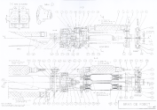{ align=left } 
    [:octicons-arrow-right-24: Plan](https://github.com/xpessoles/03_Etude_Cinematique_Systemes_Solides_Chaine_Energie_Analyser_Modeliser_Resoudre/tree/master/Mecanismes) 
	
-   :octicons-graph-16:{ .lg .middle } __Servomoteur de vanne__
 
    --- 
 
	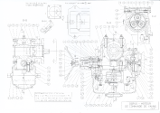{ align=left } 
    [:octicons-arrow-right-24: Plan](https://github.com/xpessoles/03_Etude_Cinematique_Systemes_Solides_Chaine_Energie_Analyser_Modeliser_Resoudre/tree/master/Mecanismes) 
	
-   :octicons-graph-16:{ .lg .middle } __Visseuse électro pneumatique__
 
    --- 
 
	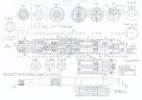{ align=left } 
    [:octicons-arrow-right-24: Plan](https://github.com/xpessoles/03_Etude_Cinematique_Systemes_Solides_Chaine_Energie_Analyser_Modeliser_Resoudre/tree/master/Mecanismes) 
	
-   :octicons-graph-16:{ .lg .middle } __Robinet__
 
    --- 
 
	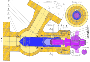{ align=left } 
    [:octicons-arrow-right-24: Plan](https://github.com/xpessoles/03_Etude_Cinematique_Systemes_Solides_Chaine_Energie_Analyser_Modeliser_Resoudre/tree/master/Mecanismes) 
	
-   :octicons-graph-16:{ .lg .middle } __Actionneur de vanne__
 
    --- 
 
	{ align=left } 
    [:octicons-arrow-right-24: Plan](https://github.com/xpessoles/03_Etude_Cinematique_Systemes_Solides_Chaine_Energie_Analyser_Modeliser_Resoudre/tree/master/Mecanismes) 
	
-   :octicons-graph-16:{ .lg .middle } __Pompe Manuelle ENSIETA__
 
    --- 
 
	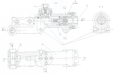{ align=left } 
    [:octicons-arrow-right-24: Plan](https://github.com/xpessoles/03_Etude_Cinematique_Systemes_Solides_Chaine_Energie_Analyser_Modeliser_Resoudre/tree/master/Mecanismes) 
	
-   :octicons-graph-16:{ .lg .middle } __Vérin pneumatique__
 
    --- 
 
	{ align=left } 
    [:octicons-arrow-right-24: Plan](https://github.com/xpessoles/03_Etude_Cinematique_Systemes_Solides_Chaine_Energie_Analyser_Modeliser_Resoudre/tree/master/Mecanismes) 
	
-   :octicons-graph-16:{ .lg .middle } __Pompe hydraulique__
 
    --- 
 
	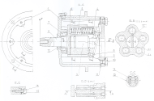{ align=left } 
    [:octicons-arrow-right-24: Plan](https://github.com/xpessoles/03_Etude_Cinematique_Systemes_Solides_Chaine_Energie_Analyser_Modeliser_Resoudre/tree/master/Mecanismes) 
	
-   :octicons-graph-16:{ .lg .middle } __Pompe doseuse__
 
    --- 
 
	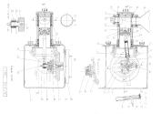{ align=left } 
    [:octicons-arrow-right-24: Plan](https://github.com/xpessoles/03_Etude_Cinematique_Systemes_Solides_Chaine_Energie_Analyser_Modeliser_Resoudre/tree/master/Mecanismes) 
	
-   :octicons-graph-16:{ .lg .middle } __Direction__
 
    --- 
 
	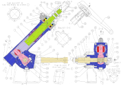{ align=left } 
    [:octicons-arrow-right-24: Plan](https://github.com/xpessoles/03_Etude_Cinematique_Systemes_Solides_Chaine_Energie_Analyser_Modeliser_Resoudre/tree/master/Mecanismes) 
	
-   :octicons-graph-16:{ .lg .middle } __Pistollet Métalliseur__
 
    --- 
 
	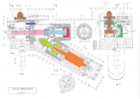{ align=left } 
    [:octicons-arrow-right-24: Plan](https://github.com/xpessoles/03_Etude_Cinematique_Systemes_Solides_Chaine_Energie_Analyser_Modeliser_Resoudre/tree/master/Mecanismes) 
	
-   :octicons-graph-16:{ .lg .middle } __Grue Hydraulique__
 
    --- 
 
	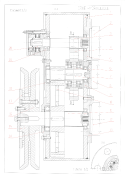{ align=left } 
    [:octicons-arrow-right-24: Plan](https://github.com/xpessoles/03_Etude_Cinematique_Systemes_Solides_Chaine_Energie_Analyser_Modeliser_Resoudre/tree/master/Mecanismes) 
	
-   :octicons-graph-16:{ .lg .middle } __Propulseur d'étrave__
 
    --- 
 
	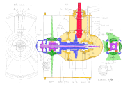{ align=left } 
    [:octicons-arrow-right-24: Plan](https://github.com/xpessoles/03_Etude_Cinematique_Systemes_Solides_Chaine_Energie_Analyser_Modeliser_Resoudre/tree/master/Mecanismes) 
	
-   :octicons-graph-16:{ .lg .middle } __Moteur de scooter__
 
    --- 
 
	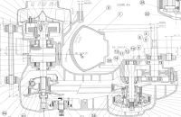{ align=left } 
    [:octicons-arrow-right-24: Plan](https://github.com/xpessoles/03_Etude_Cinematique_Systemes_Solides_Chaine_Energie_Analyser_Modeliser_Resoudre/tree/master/Mecanismes) 
	
-   :octicons-graph-16:{ .lg .middle } __Pince coupe cable__
 
    --- 
 
	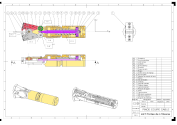{ align=left } 
    [:octicons-arrow-right-24: Plan](https://github.com/xpessoles/03_Etude_Cinematique_Systemes_Solides_Chaine_Energie_Analyser_Modeliser_Resoudre/tree/master/Mecanismes) 
	
-   :octicons-graph-16:{ .lg .middle } __Pompe doseuse__
 
    --- 
 
	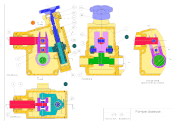{ align=left } 
    [:octicons-arrow-right-24: Plan](https://github.com/xpessoles/03_Etude_Cinematique_Systemes_Solides_Chaine_Energie_Analyser_Modeliser_Resoudre/tree/master/Mecanismes) 
	
-   :octicons-graph-16:{ .lg .middle } __Pistollet à rivelons__
 
    --- 
 
	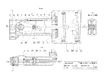{ align=left } 
    [:octicons-arrow-right-24: Plan](https://github.com/xpessoles/03_Etude_Cinematique_Systemes_Solides_Chaine_Energie_Analyser_Modeliser_Resoudre/tree/master/Mecanismes) 
	
-   :octicons-graph-16:{ .lg .middle } __Vanne cryotechnique__
 
    --- 
 
	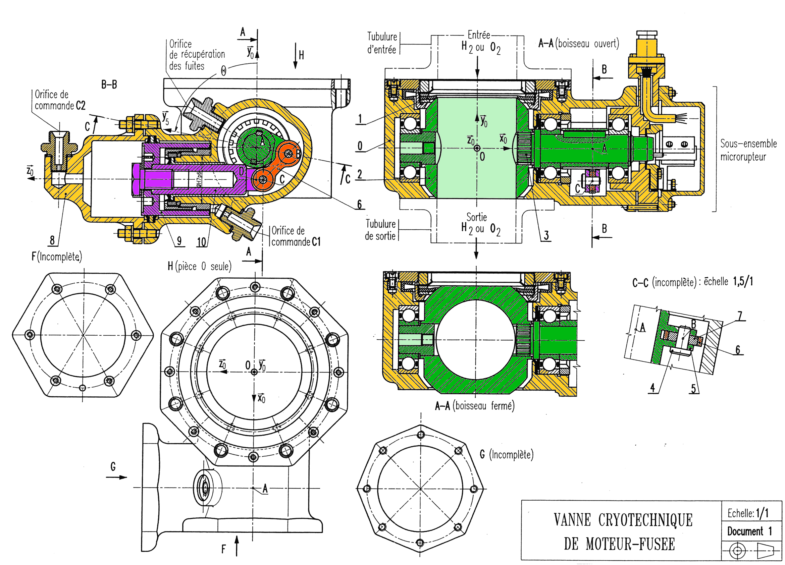{ align=left } 
    [:octicons-arrow-right-24: Plan](https://github.com/xpessoles/03_Etude_Cinematique_Systemes_Solides_Chaine_Energie_Analyser_Modeliser_Resoudre/tree/master/Mecanismes) 
	
-   :octicons-graph-16:{ .lg .middle } __Clef à chocs__
 
    --- 
 
	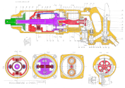{ align=left } 
    [:octicons-arrow-right-24: Plan](https://github.com/xpessoles/03_Etude_Cinematique_Systemes_Solides_Chaine_Energie_Analyser_Modeliser_Resoudre/tree/master/Mecanismes) 
	
-   :octicons-graph-16:{ .lg .middle } __Gallet freineur__
 
    --- 
 
	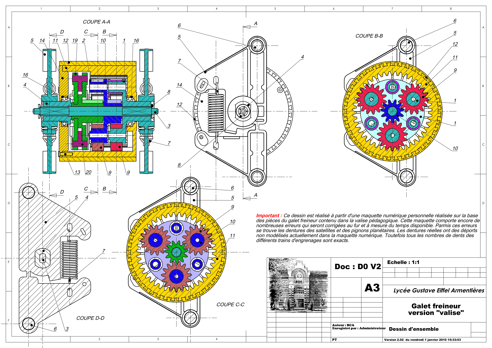{ align=left } 
    [:octicons-arrow-right-24: Plan](https://github.com/xpessoles/03_Etude_Cinematique_Systemes_Solides_Chaine_Energie_Analyser_Modeliser_Resoudre/tree/master/Mecanismes) 
	
-   :octicons-graph-16:{ .lg .middle } __Rabotteuse__
 
    --- 
 
	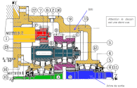{ align=left } 
    [:octicons-arrow-right-24: Plan](https://github.com/xpessoles/03_Etude_Cinematique_Systemes_Solides_Chaine_Energie_Analyser_Modeliser_Resoudre/tree/master/Mecanismes) 
	

