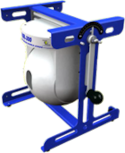

# Capteur pneumatique 

 

-   :octicons-graph-16:{ .lg .middle } __BGR-300__
 
    --- 
 
    Boule gyrostabilisée 2 étages [DIDASTEL](http://www.didastel.fr/)
    { align=left } 
 
    [:octicons-arrow-right-24: BGR-300](bgr-300.md) 

-   :octicons-graph-16:{ .lg .middle } __Bras BETA__
 
    --- 
 
    Le Bras BETA reproduit un système de cotrôle de tubes de géérateur de vapeur. [S2IDIDAC](https://s2ididac.com/)
    { align=left } 
 
    [:octicons-arrow-right-24: Bras BETA](bras-beta.md) 

