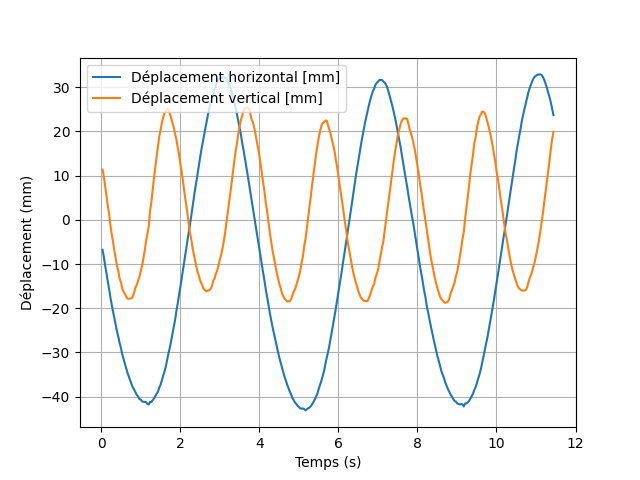
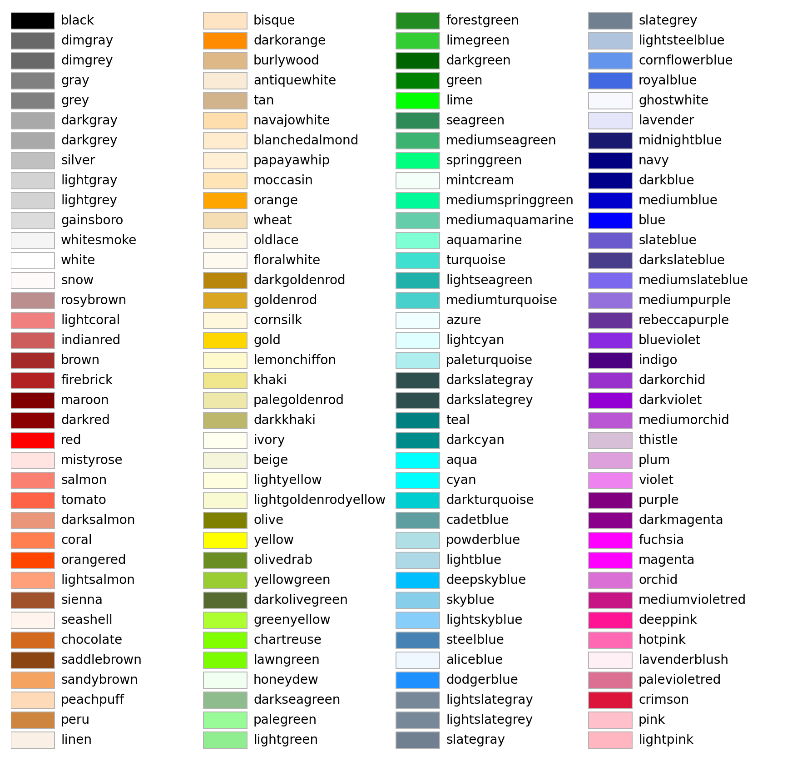
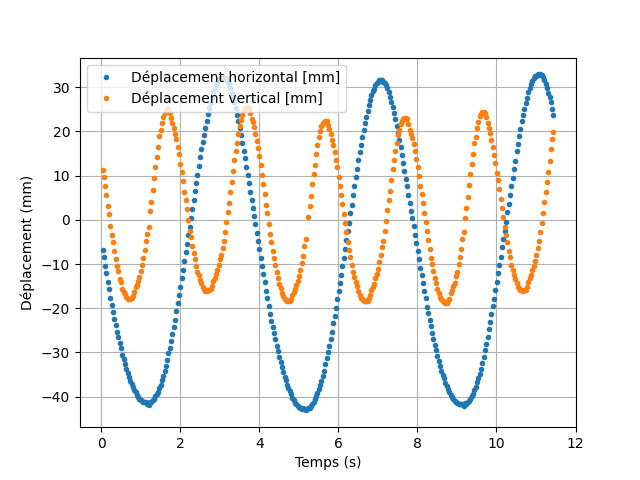

[comment]: <> (Page manuelle)


Il y a de grandes chances pour que vous ayez besoin de tracer des courbes dans le cadre de votre TIPE.
Plus que jamais, je vous conseille d'utiliser `Python` et `Matplotlib`. 

Le rendu des courbes réalisées avec Regressi, par exemple, est assez souvent décevant dans vos présentations.


On considères disposer des données stockées dans les variables `les_t`, `les_x`, `les_y` de type `list` ou des tableaux numpy `np.ndarray`.


# Tracé rapide d'une courbe

On va ici tracer une courbe avec le minimum d'informations nécessaires (titres, légende des axes).

Les points mesurés sont ici reliés par des lignes. Cela n'est pas forcément souhaitable, notamment si les points sont écartés. 
 
``` py title="Tracé de courbes"
import matplolib.pyplot as plt
plt.close()
# Tracer des courbes avec légende
plt.plot(les_t,les_x,label = 'Déplacement horizontal [mm]')
plt.plot(les_t,les_y,label = 'Déplacement vertical [mm]')

# Affichage d'une grille
plt.grid()

# AFfichage de la légende
plt.legend()
plt.xlabel("Temps (s)")
plt.ylabel("Déplacement (mm)")

# Affichage de la courbe
plt.show()
``` 

On obtient le résultat suivant. 

<figure markdown="span">
  { width="300" }
  <figcaption>Tracé des courbes</figcaption>
</figure>

Pour sauvegarder, `matplotlib` permet de sauvegarder l'image en PNG, permettant ainsi de l'ajouter à votre présentation.


??? info "Épaisseur et couleurs de lignes"

    Il est possible de modifier l'épaisseur et la couleur des traits en ajoutant des options. Par exemple :
    ``` py
    plt.plot(t,x,linewidth=3, color = "red", label = 'Déplacement horizontal [mm]')
    ```
    On donne ci-dessous la [palette de couleur](https://matplotlib.org/stable/gallery/color/named_colors.html).
    <figure markdown="span">
      { width="300" }
        <figcaption>Palette de couleurs </figcaption>
    </figure>

## Tracé des points de mesure

``` py title="Tracer de courbes"
import matplolib.pyplot as plt
plt.close()
# Tracer des courbes avec légende
plt.plot(les_t,les_x,'.',label = 'Déplacement horizontal [mm]')
plt.plot(les_t,les_y,'.',label = 'Déplacement vertical [mm]')

# Affichage d'une grille
plt.grid()

# AFfichage de la légende
plt.legend()
plt.xlabel("Temps (s)")
plt.ylabel("Déplacement (mm)")

# Affichage de la courbe
plt.show()
``` 

On obtient le résultat suivant. 

<figure markdown="span">
  { width="300" }
  <figcaption>Tracé des courbes avec les points </figcaption>
</figure>

??? info "Marqueurs"
    
	Il est possible de modifier le [marqueur de la courbe](https://matplotlib.org/stable/api/markers_api.html).

## Tracé des points de mesure, reliés
